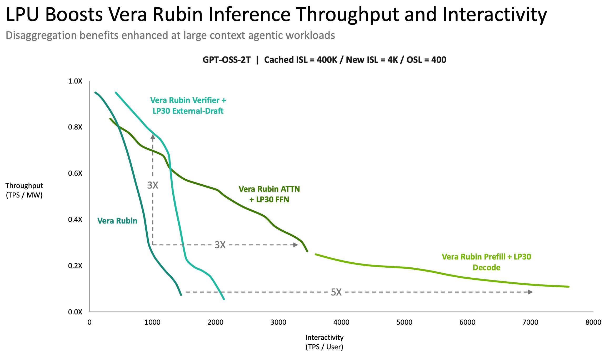
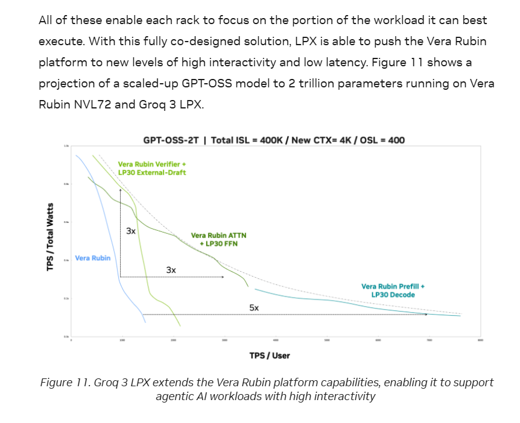
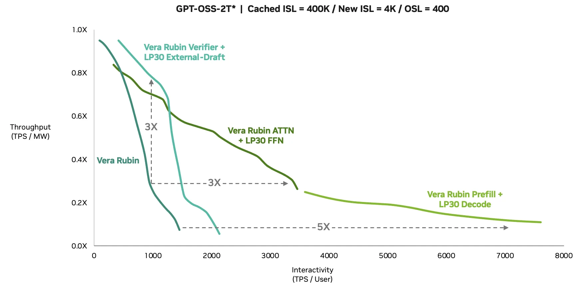

# GPT-OSS-2T 多轴缩放研究笔记

> **状态:** 持续更新。当前版本基于 2026-09-01 抓取的官方模型配置、NVIDIA 技术文章与 X 讨论。
> **范围:** 研究硬件代理配置与推理系统，不把代理模型误写成已训练、已发布的 OpenAI 模型。

## 一、背景与线索

[SemiAnalysis 原帖](https://x.com/SemiAnalysis_/status/2094470943619842286)从 NVIDIA 图表中识别出三种 Rubin + LPX 分离式推理路径：LPX 承担完整 decode、LPX 只承担 FFN，以及 LPX 充当外部 drafter。图中第一次出现了 `GPT-OSS-2T`、400K cached input、每轮 4K 新上下文和 400 输出 token 的代理工作负载。

[Lisan al Gaib 的提问](https://x.com/scaling01/status/2094471522228359604)追问“什么是 GPT-OSS-2T”，随后贴出 NVIDIA 原文截图并给出技术文章链接。截图中的关键句是：Figure 11 展示的是把 GPT-OSS 放大到 2T 参数后，在 Vera Rubin NVL72 与 Groq 3 LPX 上运行的**投影**。

NVIDIA 原始 Figure 11 如下。图中的 3x/5x 是 Pareto 方向上的投影增益，不是公开 2T checkpoint 的实测结果。

[SemiAnalysis 后续澄清](https://x.com/SemiAnalysis_/status/2094506450517123226)：GPTOSS 2T 是把 GPT-OSS-120B 的层数、隐藏维度和专家数等配置放大后得到的硬件代理，用来代表硬件团队无法取得真实权重的前沿闭源模型。这个澄清决定了本文的研究方法——我们应比较多种合理的 2T 代理，而不是假设存在唯一真实配置。

完整贴文链、讨论筛选和原始素材见 [X 线索快照](research/scaling01-2094471522228359604/README.md)。

## 二、当前结论

NVIDIA 图中的 `GPT-OSS-2T` 是从 GPT-OSS-120B 架构放大的代理配置，用于在拿不到 GPT-5、Gemini 等真实闭源权重时做硬件架构和 bring-up 研究。它不是一个公开的 2T checkpoint，图中的曲线也是 projection。

因此，研究目标不应是猜一个唯一的“真实 GPT-OSS-2T”，而应建立多个**等总参数、不同激活计算和不同长上下文机制**的候选族，观察 NVIDIA Rubin + LPX 三种分离式推理方案对哪一类架构最有利。

## 三、工业基线与缩放候选总表

[直达文末的 11 列完整宽表](#full-11-column-table)。文首保留窄表，便于 GitHub 窄窗口和移动端阅读。

<!-- BEGIN GENERATED MODEL COMPARISON -->

> 公开模型使用上游仓库精确 metadata/模型卡；F/L/G/D/K 候选使用 GPT-OSS 形状参数账本。为避免宽表溢出，参数预算、架构形状与候选定位分表展示。

**参数预算**

| 类别 | ID / 模型 | 总参数 | 激活/token | 激活比 |
|---|---|---:|---:|---:|
| 公开模型 | O20 / GPT-OSS-20B | 20.91B | 3.60B | 17.213% |
| 公开模型 | O0 / GPT-OSS-120B | 116.83B | 5.10B | 4.365% |
| 公开模型 | D0 / DeepSeek-V4-Pro | 1.599T | 49.00B | 3.065% |
| 公开模型 | K0 / Kimi-K3 | 2.780T | 104.00B | 3.741% |
| 缩放候选 | L1 / DSV4 Top-6 / 64层硬件基线 | 1.981T | 52.08B | 2.629% |
| 缩放候选 | G1 / GPT-OSS 比例 / 原生 Top-4 | 2.000T | 87.26B | 4.364% |
| 缩放候选 | G2 / GPT-OSS 比例 / 并行拓扑优先 | 1.998T | 85.90B | 4.299% |
| 缩放候选 | F1 / GPT-OSS 族谱 / 20B→120B 线性外推 | 1.997T | 14.68B | 0.735% |
| 缩放候选 | D1 / DeepSeek 比例 / Top-6 | 2.000T | 60.96B | 3.047% |
| 缩放候选 | D2 / DeepSeek 比例 / 自由 Top-N | 2.004T | 61.33B | 3.061% |
| 缩放候选 | K1 / Kimi 比例 / Top-16 | 2.007T | 74.84B | 3.729% |
| 缩放候选 | K2 / Kimi 比例 / 自由 Top-N | 2.000T | 74.85B | 3.743% |

**架构形状**

> `L` = 层数，`d` = hidden size，`E / k` = 路由专家数 / Top-k。

| ID | L | d | E / k | 上下文 | Attention |
|---|---:|---:|---:|---:|---|
| O20 | 24 | 2,880 | 32 / 4 | 131K | Sliding + Full |
| O0 | 36 | 2,880 | 128 / 4 | 131K | Sliding + Full |
| D0 | 61 | 7,168 | 384 / 6 | 1M | CSA + HCA |
| K0 | 93 | 7,168 | 896 / 16 | 1M | KDA + Gated MLA |
| L1 | 64 | 6,144 | 272 / 6 | 400K | Sliding + Full |
| G1 | 51 | 12,288 | 128 / 4 | 400K | Sliding + Full |
| G2 | 48 | 12,288 | 128 / 4 | 400K | Sliding + Full |
| F1 | 110 | 2,880 | 728 / 4 | 400K | Sliding + Full |
| D1 | 56 | 8,192 | 256 / 6 | 400K | Sliding + Full |
| D2 | 88 | 5,120 | 192 / 5 | 400K | Sliding + Full |
| K1 | 84 | 4,608 | 480 / 16 | 400K | Sliding + Full |
| K2 | 52 | 6,656 | 416 / 14 | 400K | Sliding + Full |

**模型与候选定位**

| ID | 主要轴 / 用途 |
|---|---|
| O20 | GPT-OSS family 小模型锚点 |
| O0 | 校准基线 |
| D0 | 实际 49B；2T 同比目标 61.29B |
| K0 | 实际 104B；2T 同比目标 74.82B |
| L1 | 固定 64 层、6144 宽、top-6 |
| G1 | 保持 GPT 激活比例与 top-4，主扩宽 |
| G2 | TP32 + EP64 + PP16 严格整除 |
| F1 | 沿 Δ层数=12、Δ专家=96 的配置直线外推 |
| D1 | 固定 top-6，拟合 2T / 61.29B |
| D2 | 自由 top-N，拟合 2T / 61.29B |
| K1 | 固定 top-16，拟合 2T / 74.82B |
| K2 | 自由 top-N，拟合 2T / 74.82B |

<!-- END GENERATED MODEL COMPARISON -->

### 训练与推理并行亲和性

<!-- BEGIN GENERATED PARALLEL AFFINITY -->

#### 训练维度：TP / EP / PP 亲和性

> 训练维度把 TP/EP 的整除性视为一级门槛；PP 不要求层数整除，改用“所有层等成本”假设下的 stage 利用率代理。

| ID / 模型 | 训练 TP（严格） | 训练 EP（均匀专家） | PP8 层计数代理 | PP16 层计数代理 | 实证 / 边界 |
|---|---|---:|---|---|---|
| O20 / GPT-OSS-20B | 8 | 8/16/32 | 100.0%（8×3层，等层） | 75.0%（8×2 + 8×1层，不等层） | 公开训练拓扑未完整披露；本行仅做配置算术筛选 |
| O0 / GPT-OSS-120B | 8 | 8/16/32/64 | 90.0%（4×5 + 4×4层，不等层） | 75.0%（4×3 + 12×2层，不等层） | 公开训练拓扑未完整披露；本行仅做配置算术筛选 |
| D0 / DeepSeek-V4-Pro | 自定义 CSA/HCA；V3 实证 TP1 | 8/16/32/64 | 95.3%（5×8 + 3×7层，不等层） | 95.3%（13×4 + 3×3层，不等层） | V3：TP1 / EP64 / PP16；V4 延用并调整 DualPipe |
| K0 / Kimi-K3 | 自定义 KDA/MLA；维度 8/16/32 | 8/16/32/64 | 96.9%（5×12 + 3×11层，不等层） | 96.9%（13×6 + 3×5层，不等层） | 公开训练拓扑未完整披露；本行仅做配置算术筛选 |
| L1 / DSV4 Top-6 / 64层硬件基线 | 8/16 | 8/16 | 100.0%（8×8层，等层） | 100.0%（16×4层，等层） | GPT-OSS 形状代理；尚无训练系统实测 |
| G1 / GPT-OSS 比例 / 原生 Top-4 | 8/16/32 | 8/16/32/64 | 91.1%（3×7 + 5×6层，不等层） | 79.7%（3×4 + 13×3层，不等层） | GPT-OSS 形状代理；尚无训练系统实测 |
| G2 / GPT-OSS 比例 / 并行拓扑优先 | 8/16/32 | 8/16/32/64 | 100.0%（8×6层，等层） | 100.0%（16×3层，等层） | GPT-OSS 形状代理；尚无训练系统实测 |
| F1 / GPT-OSS 族谱 / 20B→120B 线性外推 | 8 | 8 | 98.2%（6×14 + 2×13层，不等层） | 98.2%（14×7 + 2×6层，不等层） | GPT-OSS 形状代理；尚无训练系统实测 |
| D1 / DeepSeek 比例 / Top-6 | 8 | 8/16/32/64 | 100.0%（8×7层，等层） | 87.5%（8×4 + 8×3层，不等层） | GPT-OSS 形状代理；尚无训练系统实测 |
| D2 / DeepSeek 比例 / 自由 Top-N | 8/16 | 8/16/32/64 | 100.0%（8×11层，等层） | 91.7%（8×6 + 8×5层，不等层） | GPT-OSS 形状代理；尚无训练系统实测 |
| K1 / Kimi 比例 / Top-16 | 8/16 | 8/16/32 | 95.5%（4×11 + 4×10层，不等层） | 87.5%（4×6 + 12×5层，不等层） | GPT-OSS 形状代理；尚无训练系统实测 |
| K2 / Kimi 比例 / 自由 Top-N | 8/16 | 8/16/32 | 92.9%（4×7 + 4×6层，不等层） | 81.2%（4×4 + 12×3层，不等层） | GPT-OSS 形状代理；尚无训练系统实测 |

- [DeepSeek-V3 Technical Report](https://arxiv.org/html/2412.19437)是直接反例：61 层实际采用 PP16、EP64、TP1；[DeepSeek 官方 DualPipe](https://github.com/deepseek-ai/DualPipe)要求 PP stage 数与 micro-batch 数为偶数，不要求层数整除。
- [DeepSeek-V4 Technical Report](https://arxiv.org/html/2606.19348v1)给出的 V4-Pro 也是 61 层；其训练框架继承 V3，并为 mHC 增加的 stage 间通信调整了 DualPipe 1F1B。
- PP 层计数代理为 `L / (P × ceil(L/P))`。它只回答同成本层的粗粒度均衡，不包含 embedding、head、MTP、不同 attention/MoE 层成本、激活显存或通信。
- TP 候选集合为 8/16/32，严格列不允许复制 KV heads；EP 候选集合为 8/16/32/64。DP/ZeRO 通常不受模型层数整除限制。

#### 推理维度：并行亲和性

> 推理维度分开看 attention、MoE、请求并行与 pipeline；允许 KV 复制和冗余专家时，静态整除条件会比训练更宽松。

| ID / 模型 | Attention TP | MoE EP（均匀放置） | DP / 请求并行 | PP decode 层计数代理 | 实证 / 边界 |
|---|---|---:|---|---|---|
| O20 / GPT-OSS-20B | 严格 8；KV复制 8/16/32 | 8/16/32 | 无静态形状约束；取决于 batch / SLO | PP8 100.0%（8×3层，等层）；PP16 75.0%（8×2 + 8×1层，不等层） | 静态算术筛选；仍需 serving kernel 与通信实测 |
| O0 / GPT-OSS-120B | 严格 8；KV复制 8/16/32 | 8/16/32/64 | 无静态形状约束；取决于 batch / SLO | PP8 90.0%（4×5 + 4×4层，不等层）；PP16 75.0%（4×3 + 12×2层，不等层） | 静态算术筛选；仍需 serving kernel 与通信实测 |
| D0 / DeepSeek-V4-Pro | V3 实证 TP4+SP；V4 需 CSA/HCA 专用切分 | 8/16/32/64 | V3：prefill DP8；decode DP80 | PP8 95.3%（5×8 + 3×7层，不等层）；PP16 95.3%（13×4 + 3×3层，不等层） | V3 官方线上以 TP/SP+DP attention、EP MoE 为主，未采用训练 PP 拓扑 |
| K0 / Kimi-K3 | 维度 8/16/32；KDA/MLA 需专用 kernel | 8/16/32/64 | 无静态形状约束；取决于 batch / SLO | PP8 96.9%（5×12 + 3×11层，不等层）；PP16 96.9%（13×6 + 3×5层，不等层） | 配置整除不等于 KDA/LatentMoE 的实际可用拓扑 |
| L1 / DSV4 Top-6 / 64层硬件基线 | 严格 8/16；KV复制 8/16/32 | 8/16 | 无静态形状约束；取决于 batch / SLO | PP8 100.0%（8×8层，等层）；PP16 100.0%（16×4层，等层） | GPT-OSS 形状代理；PP 对吞吐可行但会增加 decode stage 延迟 |
| G1 / GPT-OSS 比例 / 原生 Top-4 | 严格 8/16/32；KV复制 8/16/32 | 8/16/32/64 | 无静态形状约束；取决于 batch / SLO | PP8 91.1%（3×7 + 5×6层，不等层）；PP16 79.7%（3×4 + 13×3层，不等层） | GPT-OSS 形状代理；PP 对吞吐可行但会增加 decode stage 延迟 |
| G2 / GPT-OSS 比例 / 并行拓扑优先 | 严格 8/16/32；KV复制 8/16/32 | 8/16/32/64 | 无静态形状约束；取决于 batch / SLO | PP8 100.0%（8×6层，等层）；PP16 100.0%（16×3层，等层） | GPT-OSS 形状代理；PP 对吞吐可行但会增加 decode stage 延迟 |
| F1 / GPT-OSS 族谱 / 20B→120B 线性外推 | 严格 8；KV复制 8/16/32 | 8 | 无静态形状约束；取决于 batch / SLO | PP8 98.2%（6×14 + 2×13层，不等层）；PP16 98.2%（14×7 + 2×6层，不等层） | GPT-OSS 形状代理；PP 对吞吐可行但会增加 decode stage 延迟 |
| D1 / DeepSeek 比例 / Top-6 | 严格 8；KV复制 8/16/32 | 8/16/32/64 | 无静态形状约束；取决于 batch / SLO | PP8 100.0%（8×7层，等层）；PP16 87.5%（8×4 + 8×3层，不等层） | GPT-OSS 形状代理；PP 对吞吐可行但会增加 decode stage 延迟 |
| D2 / DeepSeek 比例 / 自由 Top-N | 严格 8/16；KV复制 8/16/32 | 8/16/32/64 | 无静态形状约束；取决于 batch / SLO | PP8 100.0%（8×11层，等层）；PP16 91.7%（8×6 + 8×5层，不等层） | GPT-OSS 形状代理；PP 对吞吐可行但会增加 decode stage 延迟 |
| K1 / Kimi 比例 / Top-16 | 严格 8/16；KV复制 8/16/32 | 8/16/32 | 无静态形状约束；取决于 batch / SLO | PP8 95.5%（4×11 + 4×10层，不等层）；PP16 87.5%（4×6 + 12×5层，不等层） | GPT-OSS 形状代理；PP 对吞吐可行但会增加 decode stage 延迟 |
| K2 / Kimi 比例 / 自由 Top-N | 严格 8/16；KV复制 8/16/32 | 8/16/32 | 无静态形状约束；取决于 batch / SLO | PP8 92.9%（4×7 + 4×6层，不等层）；PP16 81.2%（4×4 + 12×3层，不等层） | GPT-OSS 形状代理；PP 对吞吐可行但会增加 decode stage 延迟 |

- [DeepSeek-V3 官方线上推理](https://arxiv.org/html/2412.19437)的 attention 使用 TP4+SP，并按 prefill/decode 分别组合 DP；MoE 使用大规模 EP。V4 推理框架大体继承 V3，但 CSA/HCA 改变了 KV 与 kernel 边界。
- 推理 PP 同样允许不等长 stage；是否值得使用取决于最慢 stage、micro-batch/concurrency、跨 stage 激活通信和逐 token 延迟，而不是层数取模。
- EP 列只表示无复制时专家可均匀放置。线上系统可以复制热点/共享专家，所以专家数整除也不是绝对可行性条件。
- 上下文长度现阶段仅作为候选配置字段记录，不纳入本表的并行亲和性判断。

<!-- END GENERATED PARALLEL AFFINITY -->

### 参数计数口径

[逐张量参数账本](research/model-scaling/parameter_accounting.py)不使用“约多少 B”的心算，而是分别列出 embedding、LM head、attention 权重/偏置、norm、router、全部专家和激活专家，然后以整数求和。这里的“精确”指**对声明的 GPT-OSS 形状 tensor schema 精确**。

公开 GPT-OSS-20B / 120B checkpoint metadata 分别为 20,914,757,184 / 116,829,156,672 个元素；账本按逻辑架构得到 20,908,120,128 / 116,789,341,248，误差分别为 -0.032% / -0.034%。这些差异不会被偷偷摊回候选，可能来自量化 checkpoint 的辅助 scale 或实现专用张量。候选之间统一使用同一逻辑 schema，因此横向比较不受该残差影响。

三条工业基线同比到 2T 后的激活目标分别为：

- GPT-OSS-120B：4.365349% → **87,306,972,767**。
- DeepSeek-V4-Pro：3.064723% → **61,294,450,936**。
- Kimi-K3：3.741099% → **74,821,978,445**。

当前候选的整数账本结果：

- **F1 / GPT-OSS family 线性外推:** 总参数 1,996,956,778,640；激活参数 14,679,597,200。
- **G1 / GPT top-4:** 总参数 1,999,517,313,408；激活参数 87,262,292,352。
- **G2 / GPT 并行拓扑优先:** 总参数 1,998,153,467,904；激活参数 85,898,446,848。
- **D1 / DeepSeek top-6:** 总参数 2,000,372,791,296；激活参数 60,957,030,400。
- **D2 / DeepSeek 自由 top-5:** 总参数 2,003,585,906,176；激活参数 61,327,586,816。
- **K1 / Kimi top-16:** 总参数 2,006,838,708,096；激活参数 74,837,755,776。
- **K2 / Kimi 自由 top-14:** 总参数 1,999,617,353,344；激活参数 74,848,691,840。

G/D/K 比例候选分别保持自己的工业基线激活比例，不再共享一个错误的绝对激活目标；F1 则沿 GPT-OSS family 的已观测配置直线外推，不保持 20B 或 120B 的激活比例。

当前阶段把“2T”拆为五个互相独立的轴：

1. **总容量:** 主要由专家权重决定。
2. **激活容量:** top-k、共享专家和 dense/attention 部分决定每 token 实际计算。
3. **顺序深度:** 层数决定不可并行的关键路径。
4. **矩阵宽度:** hidden/intermediate 决定单层 GEMM 规模和 tensor parallel 效率。
5. **并行拓扑:** 专家数与 EP，宽度与 TP，层数与 PP 的可分解性不同。

上下文长度现阶段只记录为候选配置字段，不参与本轮参数缩放与候选筛选。

## 四、GPT-OSS 族谱与工业比例候选

### 20B → 120B → 2T 配置直线

[OpenAI 模型卡](https://deploymentsafety.openai.com/gpt-oss/paperbench)和两个公开配置表明，GPT-OSS-20B 到 GPT-OSS-120B 没有扩宽 hidden、专家 intermediate、attention heads 或 KV heads，也没有改变 top-4；观测到的变化只有层数 `24 → 36` 和专家数 `32 → 128`。

| GPT-OSS family | 总参数 | 激活/token | 层数 | Hidden | 专家 / Top-k |
|---|---:|---:|---:|---:|---:|
| 官方 20B | 20.91B | 3.60B | 24 | 2,880 | 32 / 4 |
| 官方 120B | 116.83B | 5.10B | 36 | 2,880 | 128 / 4 |
| F1 / 2T 线性外推 | 1.997T | 14.68B | 110 | 2,880 | 728 / 4 |

这里的“线性”特指在 `(层数, 专家数)` 配置坐标中沿两点确定的直线继续前进，而不是假定层数和专家数各自都与总参数标签线性。我们把这条配置直线写成：

$$
L(t)=24+12t,\qquad E(t)=32+96t
$$

其中 `t=0` 是 20B、`t=1` 是 120B。由于专家权重含有 `L × E` 项，总参数沿这条配置直线不是 `t` 的线性函数；用逐张量账本求解 `P(t)=2T` 得到 `t=7.218672`、连续解 `L=110.624`、`E=724.993`。将层数对齐为偶数、专家数对齐到 EP8 后，得到 F1：**110 层、728 专家、top-4、hidden 2,880，总参数 1.997T、激活 14.68B**。

F1 是最字面的 GPT-OSS family 线性外推锚点，不是保持 120B 激活比例的方案。因为专家库存快速增加而每 token 始终只选 4 个，激活占比从 20B 的 17.21%、120B 的 4.37% 继续降到 F1 的 **0.735%**。同时 728 个专家只能严格支持 EP8，因此它的原生族谱解释力强，但并行拓扑不如 G2。

可复算结果见 [生成候选表](research/model-scaling/candidates.generated.md)。删除专家数、深度和宽度三个极端单轴反例后，保留以下更有研究价值的候选：

- **F1 GPT-OSS family / 20B→120B 线性外推:** 保持 family 已观测的不变轴，沿层数与专家数的配置直线外推到约 2T；110 层、hidden 2,880、728 专家、top-4，激活约 14.68B。
- **L1 DSV4 top-6 / 64层硬件基线:** 64 层、hidden 6,144、272 专家、top-6，总量约 1.98T、激活约 52B。它与 DSV4 对齐的是 top-6 路由语义，并提供 EP16/PP16 友好的固定形状；不冒充 DSV4 同比激活预算。
- **G1 GPT-OSS 比例 / top-4:** 保留原生 128 专家和 top-4，采用 51 层、hidden 12,288、expert intermediate 8,192。它主要沿宽度轴放大，同时保持 GPT 的 4.365% 激活比例。
- **G2 GPT-OSS 比例 / 并行拓扑优先:** 保留 128 专家和 top-4，采用 48 层、hidden 12,288、expert intermediate 8,704。它牺牲少量激活比例拟合精度，换取 TP32、EP64、PP16 全部严格整除。
- **D1 DeepSeek 比例 / top-6:** 固定 top-6，采用 56 层、hidden 8,192、256 专家；更接近常见 kernel 维度，并支持 EP64、PP8。
- **D2 DeepSeek 比例 / 自由 top-N:** 严格亲和网格得到 top-5、88 层、hidden 5,120、192 专家，用于与 D1 分离 top-N 和专家宽度的影响。
- **K1 Kimi 比例 / top-16:** 固定 top-16，采用 84 层、hidden 4,608、480 专家；支持 TP16、EP32、PP4。
- **K2 Kimi 比例 / 自由 top-N:** 严格亲和网格得到 top-14、52 层、hidden 6,656、416 专家，用于与 K1 比较更少、更宽的激活专家。

这些仍然是 **GPT-OSS 形状的逻辑代理**：D/K 候选只匹配总量、激活比例和 top-N，不复制 DeepSeek 的 CSA/HCA 或 Kimi 的 Stable LatentMoE、KDA/MLA。所有缩放候选的上下文字段统一记录 NVIDIA Figure 11 的 400K 工作负载；该字段不参与参数账本，也不影响本文的缩放计算。D0/K0 的 1M 与 O20/O0 的 131K 则保留各公开模型的官方能力值。

## 五、Rubin + LPX 三种模式如何映射候选

1. **Rubin prefill + LPX decode:** 更偏好 active 参数较低、decode GEMM 规则的候选，L1 是计算侧下界。但任何约 2T 权重都不可能整体常驻单个 128GB LPX，必须明确跨 rack 权重/专家放置与传输边界。
2. **Rubin attention + LPX FFN:** 更偏好 FFN 占 active FLOPs 高、attention/KV 留在 Rubin 的候选。D1/D2 与 K1/K2 是两档直接对照；KDA/HCA 会改变比例。
3. **LPX drafter + Rubin verifier:** 性能依赖真实 token 分布与接受率。只有 tensor shape 的 2T 代理无法验证 speculative/MTP 质量，最多估算 verifier 和 drafter 的计算/通信上界。

## 六、验证顺序

### S0：参数账本

- 用公开配置和 safetensors metadata 对齐总参数。
- 把 active 参数的定义固定为：LM head + dense attention + router + top-k experts；embedding lookup 不按整矩阵计入。
- 对自定义架构单独写参数公式，禁止套用普通 SwiGLU MoE 公式。

### S1：静态成本模型

- 权重字节：MXFP4/FP4/FP8/BF16 分项。
- 每 token active FLOPs、router FLOPs、attention FLOPs。
- TP/EP/PP 的最小可整除拓扑。

### S2：分离式推理通信模型

- prefill/decode：阶段边界与跨设备状态传输量。
- attention/FFN：每 full-attention layer 的跨 rack 中间状态。
- drafter/verifier：draft tokens、拒绝位置和双侧 KV 状态。

### S3：可复现 Pareto 曲线

- 横轴明确为 steady-state decode TPS/user，另报 TTFT。
- 纵轴明确功耗边界：单 rack、两类 rack 之和或整套系统。
- 同时报告 aggregate TPS、TPS/user、tokens/joule，避免“interactivity”替代全部 latency 指标。

## 七、目前最关键的未知量

1. NVIDIA 实际使用的 GPT-OSS-2T proxy config。
2. 2T 是总 MoE 参数还是另有 dense/vision 组件。
3. 代理的 top-k、共享专家、attention layer pattern 和 active 参数。
4. Figure 11 中每条曲线的 rack 数、batch/concurrency、精度和功耗边界。
5. LPX 128GB SRAM 是单系统还是图中解码配置的总 SRAM。
6. speculative decoding 使用的 drafter 尺寸、lookahead 和真实接受率。

## 八、证据与来源

- [OpenAI gpt-oss-120b](https://huggingface.co/openai/gpt-oss-120b)
- [OpenAI gpt-oss-20b](https://huggingface.co/openai/gpt-oss-20b)
- [OpenAI GPT-OSS 模型卡](https://deploymentsafety.openai.com/gpt-oss/paperbench)
- [OpenAI 官方 Transformers 指南](https://developers.openai.com/cookbook/articles/gpt-oss/run-transformers/)
- [DeepSeek-V3 Technical Report：61 层、PP16 / EP64 / TP1](https://arxiv.org/html/2412.19437)
- [DeepSeek 官方 DualPipe 实现](https://github.com/deepseek-ai/DualPipe)
- [DeepSeek-V4 Technical Report：61 层并延用 DualPipe](https://arxiv.org/html/2606.19348v1)
- [Moonshot Kimi-K3](https://huggingface.co/moonshotai/Kimi-K3)
- [DeepSeek-V4-Pro](https://huggingface.co/deepseek-ai/DeepSeek-V4-Pro)
- [NVIDIA Groq 3 LPX / Vera Rubin 技术文章](https://developer.nvidia.com/blog/how-nvidia-groq-3-lpx-unlocks-ultrafast-interactivity-at-long-context-on-nvidia-vera-rubin/)
- [X 线索与讨论快照](research/scaling01-2094471522228359604/README.md)
- [参考写作仓库](https://github.com/Sawyer117/dsv4-dspark-article)

## 附录：11 列完整宽表

<!-- BEGIN GENERATED 11-COLUMN TABLE -->

> 完整字段横向对照；窄屏设备可能需要横向滚动。数据与文首窄表由同一脚本生成。

| 性质 | ID / 模型 | 总参数 | 激活/token | 激活/总量 | 层数 | Hidden | 专家 / Top-k | 上下文 | Attention | 主要轴 / 用途 |
|---|---|---:|---:|---:|---:|---:|---:|---:|---|---|
| 公开模型 | O20 / GPT-OSS-20B | 20.91B | 3.60B | 17.213% | 24 | 2,880 | 32 / 4 | 131K | Sliding + Full | GPT-OSS family 小模型锚点 |
| 公开模型 | O0 / GPT-OSS-120B | 116.83B | 5.10B | 4.365% | 36 | 2,880 | 128 / 4 | 131K | Sliding + Full | 校准基线 |
| 公开模型 | D0 / DeepSeek-V4-Pro | 1.599T | 49.00B | 3.065% | 61 | 7,168 | 384 / 6 | 1M | CSA + HCA | 实际 49B；2T 同比目标 61.29B |
| 公开模型 | K0 / Kimi-K3 | 2.780T | 104.00B | 3.741% | 93 | 7,168 | 896 / 16 | 1M | KDA + Gated MLA | 实际 104B；2T 同比目标 74.82B |
| 缩放候选 | L1 / DSV4 Top-6 / 64层硬件基线 | 1.981T | 52.08B | 2.629% | 64 | 6,144 | 272 / 6 | 400K | Sliding + Full | 固定 64 层、6144 宽、top-6 |
| 缩放候选 | G1 / GPT-OSS 比例 / 原生 Top-4 | 2.000T | 87.26B | 4.364% | 51 | 12,288 | 128 / 4 | 400K | Sliding + Full | 保持 GPT 激活比例与 top-4，主扩宽 |
| 缩放候选 | G2 / GPT-OSS 比例 / 并行拓扑优先 | 1.998T | 85.90B | 4.299% | 48 | 12,288 | 128 / 4 | 400K | Sliding + Full | TP32 + EP64 + PP16 严格整除 |
| 缩放候选 | F1 / GPT-OSS 族谱 / 20B→120B 线性外推 | 1.997T | 14.68B | 0.735% | 110 | 2,880 | 728 / 4 | 400K | Sliding + Full | 沿 Δ层数=12、Δ专家=96 的配置直线外推 |
| 缩放候选 | D1 / DeepSeek 比例 / Top-6 | 2.000T | 60.96B | 3.047% | 56 | 8,192 | 256 / 6 | 400K | Sliding + Full | 固定 top-6，拟合 2T / 61.29B |
| 缩放候选 | D2 / DeepSeek 比例 / 自由 Top-N | 2.004T | 61.33B | 3.061% | 88 | 5,120 | 192 / 5 | 400K | Sliding + Full | 自由 top-N，拟合 2T / 61.29B |
| 缩放候选 | K1 / Kimi 比例 / Top-16 | 2.007T | 74.84B | 3.729% | 84 | 4,608 | 480 / 16 | 400K | Sliding + Full | 固定 top-16，拟合 2T / 74.82B |
| 缩放候选 | K2 / Kimi 比例 / 自由 Top-N | 2.000T | 74.85B | 3.743% | 52 | 6,656 | 416 / 14 | 400K | Sliding + Full | 自由 top-N，拟合 2T / 74.82B |

<!-- END GENERATED 11-COLUMN TABLE -->
